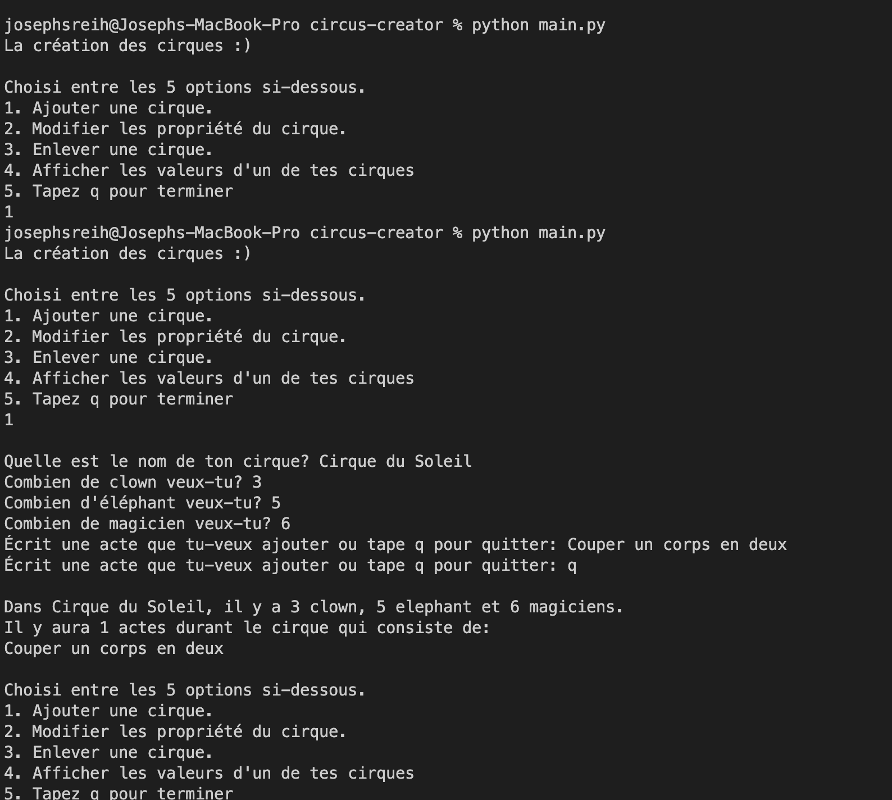

### Circus Creator
A circus file created using class and decorators, imported into a main file where the user can interact and create their own circus. 

Note: This program was coded in french. 

# Instructions
1. `https://github.com/jSreih/circus-creator.git`
2. `cd circus-creator`
3. `python main.py`

# Demo

